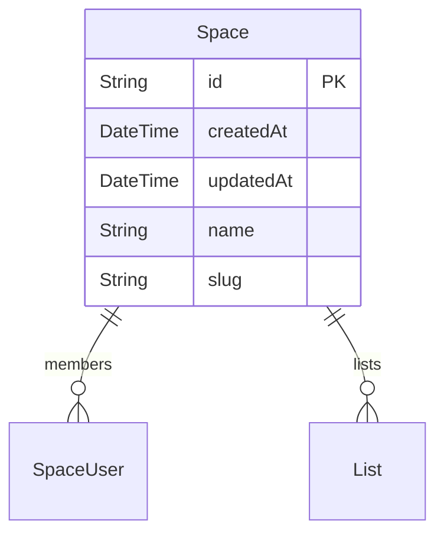
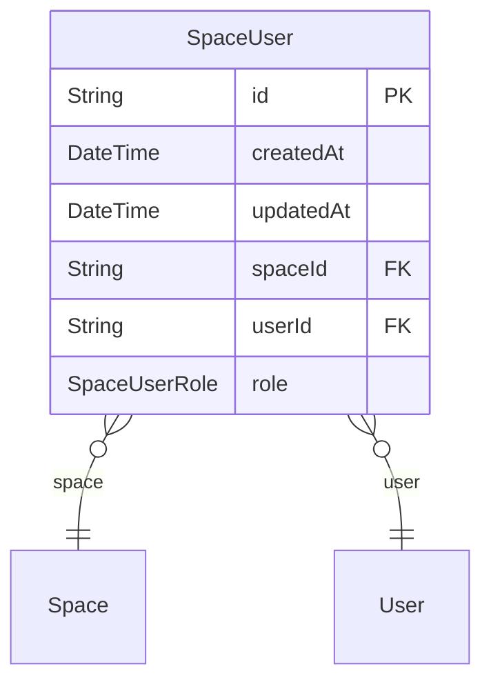
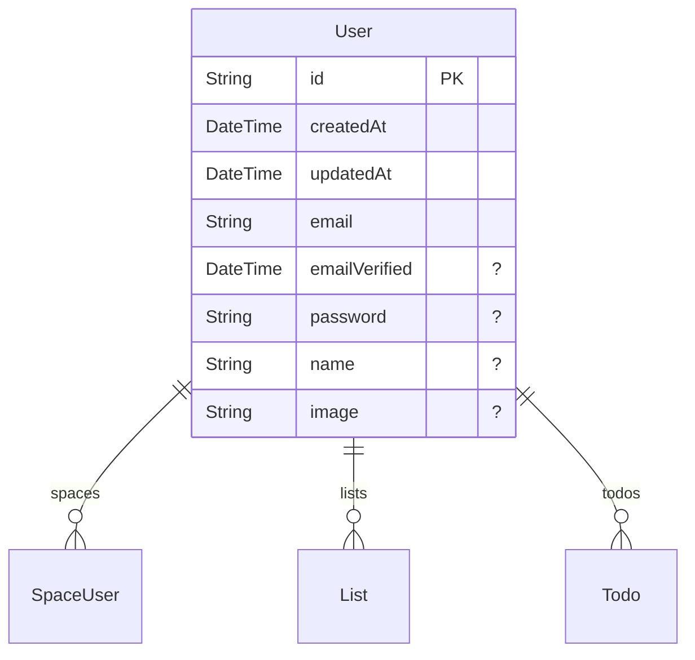
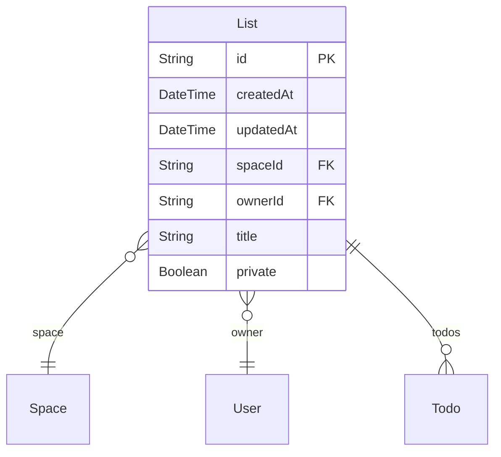
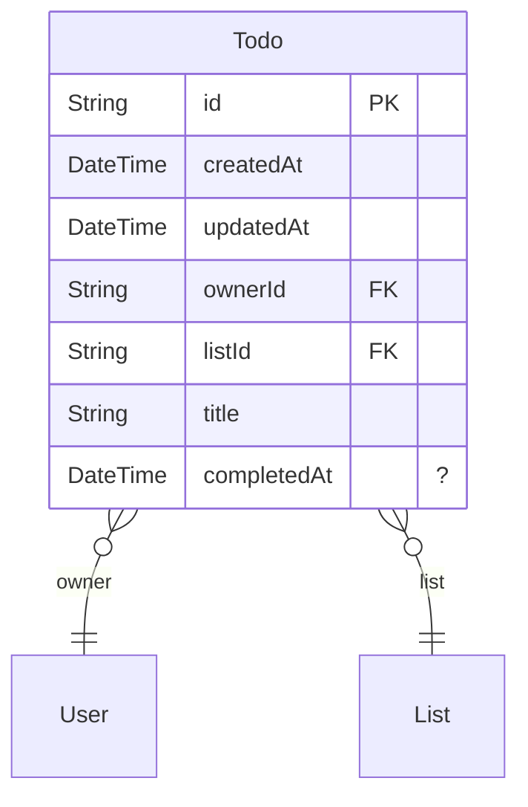

# Overview

> Generated by [`ZenStack-markdown`](https://github.com/jiashengguo/zenstack-markdown)

This application is designed to manage collaborative spaces where users can create and manage lists and todos within those spaces. It provides a structured environment for task management, team collaboration, and personal organization within a shared context.

## Functionality

The app allows users to:
- Create and manage personal and shared spaces.
- Invite members to spaces with different roles (USER or ADMIN).
- Create lists within spaces, which can be private or public.
- Add todos to lists, track their completion status.
- Control access to spaces, lists, and todos based on user roles and ownership.

Models:

- [Space](#Space)
- [SpaceUser](#SpaceUser)
- [User](#User)
- [List](#List)
- [Todo](#Todo)

## Space

- @@deny('all', auth() == null)
- @@allow('create', true)
- @@allow('read', members?[user == auth()])
- @@allow('update,delete', members?[user == auth() && role == ADMIN])
## SpaceUser

- @@deny('all', auth() == null)
- @@allow('create,update,delete', space.members?[user == auth() && role == ADMIN])
- @@allow('read', space.members?[user == auth()])
## User

- @@allow('create', true)
- @@allow('read', spaces?[space.members?[user == auth()]])
- @@allow('all', auth() == this)
## List

- @@deny('all', auth() == null)
- @@allow('read', owner == auth() || (space.members?[user == auth()] && !private))
- @@allow('create', owner == auth() && space.members?[user == auth()])
- @@allow('update', owner == auth() && space.members?[user == auth()] && future().owner == owner)
- @@allow('delete', owner == auth())
## Todo

- @@deny('all', auth() == null)
- @@allow('all', list.owner == auth())
- @@allow('all', list.space.members?[user == auth()] && !list.private)
- @@deny('update', future().owner != owner)
